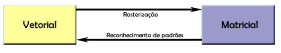

dispositios gráficos periféricos podem ser classificados, entre outras seugndo 2 visões:
- finalidade: - entrada   - saída
- formato dos dados: - matricial   - vetorial
---
## representação vetorial

estruturas de dados utilizam pontos e vetores cujas coordenadas são números reais. se faz necessário o uso de aproimações usando representação em ponto-flutuante

complexidade de processamento = O (nº vértices / vetores)

---
**exibição:**
- dispositivos vetoriais
- dispositivos matriciais (requer amostragem, i.e., rasterização)
---
## representação matricial
- representação flexível e muito comum
- compleidade de processamento = O (nº de pixels)
- muitas operações implicam em perda de precisão(reamostragem)
    - ex: rotação, escala
    - técnicas para lidar com o problema
       - ex: técnicas anti-serrilhado(anti-aliasing)
- exibição
  - dispositivos matriciais
  - dispositivos vetoriais (requer uso de técnicas de reconhecimento de padrões)
---
## representação vetorial e matricial

